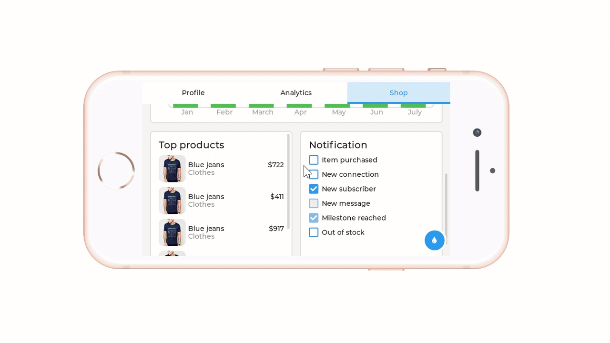

LittleVGL for N9H30 non-OS Bare Metal
https://github.com/symfund/N9H30_emWin_NonOS


# Cross compiling LVGL for framebuffer Linux on MA35D1
Suppose that the toolchain is installed in **/opt/oecore-x86_64**. 
Execute the following command to setup build environment.

**$ source /opt/oecore-x86_64/environment-setup-aarch64-poky-linux** 

To build the LVGL, just type **make**.

**$ cd lv_port_linux_frame_buffer**

**$ make**


# Running on MA35D1 EVAL Boad

auto-start LittlevGL upon first boot through Systemd service

```
[Unit]
Description=start LittlevGL upon first boot

[Service]
ExecStart=/usr/sbin/LVGL_demo
Type=simple

[Install]
WantedBy=multi-user.target
```


# PC Win32 Simulator
**LANDSCAPE PORTRAIT**


# Animation
This is a GIF animation, please wait patiently!

